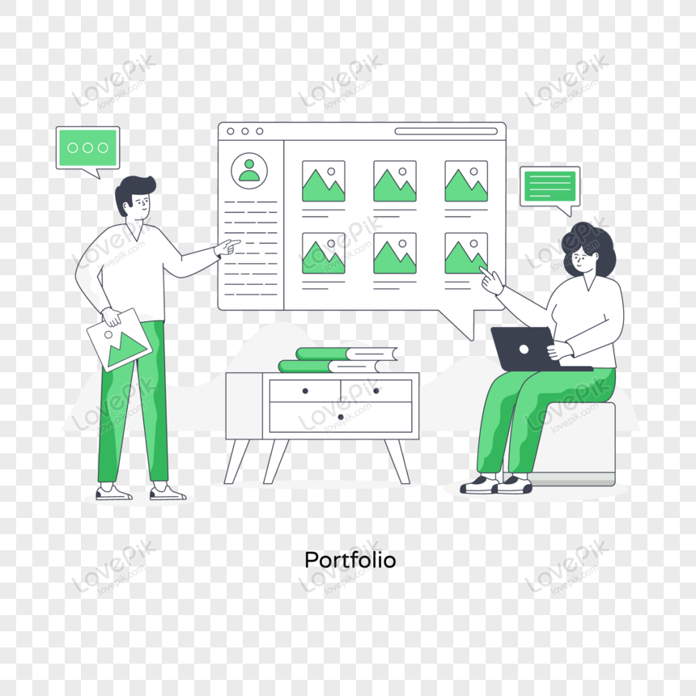

### Hi there, I'm <a href="https://www.datascienceportfol.io/harshindoria" target="_blank" title="Harsh Indoria">Harsh Indoria</a> 👋

 

### Glad to see you here!

Love interacting with the community, sharing knowledge, and learning new things.

**Talking about personal stuff:**

- 👨 I’m Harsh Indoria.
- 👀 I’m interested in Data Analytics.
- 📚 I have a Integrated Master’s degree in Applied Mathematics from IIT Roorkee.
- 🌱 I’m currently working on various Data Science Projects.
- - 📧 How to reach me: harsh.ind.coder@gmail.com

<!---
harshindcoder/harshindcoder is a ✨ special ✨ repository because its `README.md` (this file) appears on your GitHub profile.
You can click the Preview link to take a look at your changes.
--->
